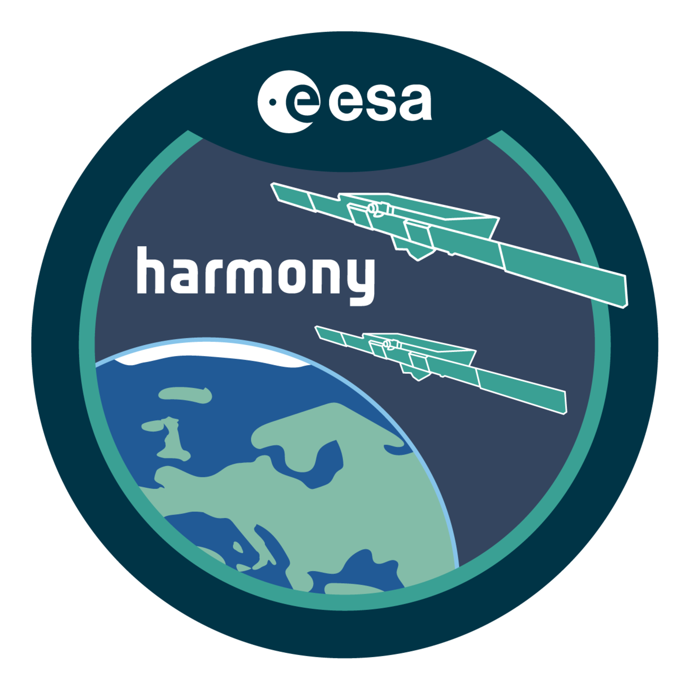

# Would you like to see my blood, sweat, and tears so far? :muscle: Go ahead, Houston … :satellite: :satellite:

> **Satellite Ground Segment Architect — Payload Data Processing** — 16 satellite missions across
> Phase 0–E. ESA Harmony / EOF-EOS experience, L0→L2 processing chains, pushbroom multispectral &
> hyperspectral Cal/Val, and Earth-observation ML.

**Find me:** [LinkedIn](https://www.linkedin.com/in/candenizkaya/) · [Email](mailto:candenizkaya17@gmail.com) · Berlin

:globe_with_meridians: **Full portfolio:** [astrocan17.github.io/AstroCan17](https://astrocan17.github.io/AstroCan17/) — [projects](https://astrocan17.github.io/AstroCan17/projects/), [experience & Cal/Val depth](https://astrocan17.github.io/AstroCan17/experience.html)

> :red_circle: **Note:** This profile is prepared using publicly available information from the
> literature and reflects concepts I have learned during my professional experience. It does **not**
> include any proprietary or confidential information.

### Mission Patches

    
    
    
    
    

---

## :artificial_satellite: Featured Projects

### [eo-data-embedding](https://github.com/AstroCan17/eo-data-embedding) — multi-modal geospatial embedding search & change detection

Embed Sentinel-1/2 imagery **once** with a frozen **Clay v1.5** ViT; similarity search, few-shot classification, and change detection over stored vectors — CPU-only demo included.

:page_facing_up: [Overview](https://astrocan17.github.io/AstroCan17/projects/eo-data-embedding.html) · :link: [Repository](https://github.com/AstroCan17/eo-data-embedding) · :books: [Docs](https://astrocan17.github.io/eo-data-embedding/)

### [msi-processor](https://github.com/AstroCan17/msi-processor) — pushbroom MSI ground-segment L0→L2

Generic MSI processor on EOPF CPM — eight processing units (l0_decode → radiometric → enhancement → toa → coregister → georeference → atmospheric → pansharpen), ECSS Cat-C, CI-green.

:page_facing_up: [Overview](https://astrocan17.github.io/AstroCan17/projects/msi-processor.html) · :link: [Repository](https://github.com/AstroCan17/msi-processor) · :books: [Docs](https://astrocan17.github.io/msi-processor/)

### [s2-msi-raw-generator](https://github.com/AstroCan17/s2-msi-raw-generator) — Sentinel-2 MSI Synthetic Raw Data Generator

Runs **S2B L1B** backwards through the operational radiometric chain; validates **Synthetic L0** against reference ESA L0 to **≤ ~4 DN** on 10/20 m bands.

:page_facing_up: [Overview](https://astrocan17.github.io/AstroCan17/projects/s2-msi-raw-generator.html) · :link: [Repository](https://github.com/AstroCan17/s2-msi-raw-generator) · :books: [Docs](https://astrocan17.github.io/s2-msi-raw-generator/)

### [sar-processor](https://github.com/AstroCan17/sar-processor) — spaceborne SAR L0→SLC→GRD

Sensor-agnostic SAR forward processor on EOPF; Sentinel-1 C-SAR reference profile; ECSS skeleton (pre-SRR).

:page_facing_up: [Overview](https://astrocan17.github.io/AstroCan17/projects/sar-processor.html) · :link: [Repository](https://github.com/AstroCan17/sar-processor) · :books: [Docs](https://astrocan17.github.io/sar-processor/)

:link: [IPF ecosystem overview](https://astrocan17.github.io/AstroCan17/projects/ipf-ecosystem.html) — how generator, processor, and data-store connect.

---

## :toolbox: Skills & Tools

- **Languages:** Python · C · MATLAB
- **EO / imaging:** GDAL · rasterio · OpenCV · scikit-image · NumPy · Earth Engine API · Py6S
- **ML / DL:** PyTorch · Keras · CNNs · R-CNN / YOLO / SSD
- **Infra / engineering:** Docker · Kubernetes · Dask (distributed) · CI/CD · Git · Pytest · PEP 8 · GPU programming · Linux / shell
- **GIS / tooling:** ENVI · ArcMap · QGIS · Global Mapper · PCI Geomatica · Qt Designer
- **Products:** Sentinel-1 (SAR) · Sentinel-2 A/B · Sentinel-5P · Landsat 7/8/9 · ASTER · MRO CTX / HiRISE
- **Domains:** AOCS · System Engineering · Optical Design · Optoelectronics · Mission Planning

:microscope: Cal/Val depth, on-orbit NUC/MTF, and L0–L2 pipeline detail on the **[Experience page](https://astrocan17.github.io/AstroCan17/experience.html)**.
