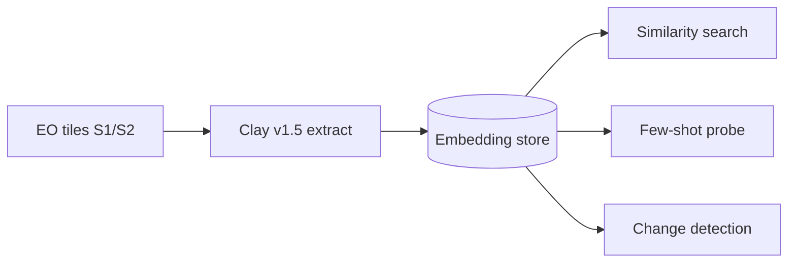

# eo-data-embedding

  <strong>Status:</strong> Released 
  <strong>Stack:</strong> Python 3.11 · PyTorch · Clay v1.5 · FAISS · Gradio
  <strong>Lifecycle:</strong> ECSS-E-ST-40C tailored

## Overview

**eo-data-embedding** embeds Sentinel-1/2 imagery **once** with a frozen [Clay v1.5](https://clay-foundation.github.io/model/) Vision Transformer, then serves every downstream task cheaply over the stored vectors — **similarity search**, **few-shot classification**, and **bitemporal change detection** — with no per-task fine-tuning and no GPU at query time.

The design goal is label-efficient, honest EO ML: embed-once architecture, CPU-only query path, and negative results reported rather than hidden.

## Architecture

Key properties:

- **Frozen foundation model** — Clay v1.5 ViT; no per-task fine-tuning at query time.
- **CPU-only demo** — `eo-data-embedding demo` downloads a public bundle and serves a Gradio UI without GPU.
- **ECSS-tailored lifecycle** — ECSS-E-ST-40C engineering + DRD set, ECSS-E-HB-40-02A ML V&V, ECSS-Q-ST-80C product assurance.

## Key technical work

- Multi-modal tile ingestion and normalisation for Sentinel-1 SAR and Sentinel-2 MSI inputs.
- Vector extraction pipeline with deterministic, reproducible embedding storage.
- FAISS-backed cosine similarity search over precomputed embeddings.
- Few-shot linear probe with label-efficiency evaluation across training-set sizes.
- Bitemporal change detection via supervised Δembedding classifier; zero-training distance baseline explicitly rejected when at chance level.

## Results

| Task | Metric | Result |
|------|--------|--------|
| Similarity search | mAP@10 | **0.774** |
| Similarity search | precision@10 | **0.822** |
| Few-shot probe | macro-F1 (50 labels/class) | **0.895 ± 0.011** |
| Few-shot probe | macro-F1 (full train pool) | **0.92** |
| Change detection | supervised Δembedding F1 | **0.510** (honest, validation threshold) |
| Change detection | ROC-AUC | **0.640** |

  
  

## Links

- [GitHub repository](https://github.com/AstroCan17/eo-data-embedding)
- [Documentation site](https://astrocan17.github.io/eo-data-embedding/)
- [V&V report](https://github.com/AstroCan17/eo-data-embedding/blob/main/compliance/drd/vv-report.md)
- [ECSS compliance tree](https://github.com/AstroCan17/eo-data-embedding/tree/main/compliance)

[← All projects]({{ site.baseurl }}/projects/)
