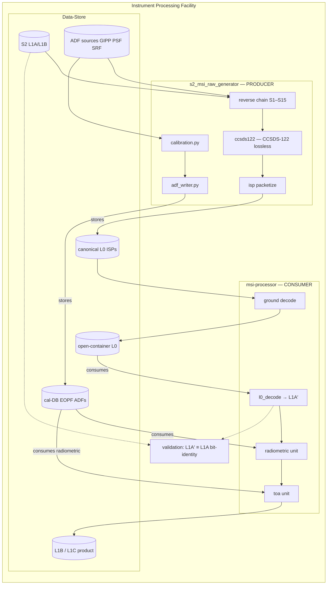

# IPF Ecosystem

  <strong>Role:</strong> Integration architecture
  <strong>Components:</strong> Generator · Processor · Data-store
  <strong>Validation:</strong> Non-tautological L0→L1B round-trip

## Overview

The **Instrument Processing Facility (IPF)** prototype ties three open-source projects into a single validated ground-segment workflow. A **producer** ([Sentinel-2 MSI Synthetic Raw Data Generator]({{ site.baseurl }}/projects/s2-msi-raw-generator.html)) synthesises **Synthetic L0** raw data and a calibration database from **S2 L1B** inputs; a **consumer** (`msi-processor`) runs the forward L0→L2 chain on those products; and a **data-store** registry provides versioned, sha256-verified package exchange between them.

This architecture enables **non-tautological validation**: calibration coefficients are derived (diffuser + dark), not copied from a truth ADF, so the processor round-trip genuinely tests the chain.

## Architecture

## Data-store layers

| Layer | Where | Role |
|-------|-------|------|
| **Package Registry** | GitLab / release tags | Durable, versioned DB — immutable package versions (ECSS-friendly configuration control) |
| **Local store** | Filesystem (`~/data-store` on SDE) | Working copy the pipeline reads/writes |
| **Sync** | `run_pipeline.py --phases fetch-store` / `publish-store` | Pull/push between registry and local store, sha256-verified via manifest |

## Validation story

1. **Producer reverse chain** — S2B L1B → **Synthetic L0** `img`; validated against reference ESA L0 to ≤ ~4 DN on 10/20 m bands.
2. **L0plus codec** — `decode(L0plus) == L1A` bit-exact; lossless ratio 3.66×.
3. **Consumer forward chain** — `l0_decode → radiometric → enhancement → toa` produces L1B TOA-reflectance from producer's open-container L0 + cal-DB.
4. **Bit-identity check** — L1A′ ≡ L1A through `l0_decode` on all 13 bands.
5. **Calibration cross-validation** — `--mode calibration` derives NUC from dark+flatfield and cross-validates against producer-derived coefficients.

## Component case studies

- [Sentinel-2 MSI Synthetic Raw Data Generator]({{ site.baseurl }}/projects/s2-msi-raw-generator.html) — producer, S2 L1B → Synthetic L0 reverse chain
- [msi-processor]({{ site.baseurl }}/projects/msi-processor.html) — consumer, L0→L2 forward chain
- [sar-processor]({{ site.baseurl }}/projects/sar-processor.html) — planned SAR sibling on the same platform

## Links

- [msi-processor on GitHub](https://github.com/AstroCan17/msi-processor)
- [s2-msi-raw-generator on GitHub](https://github.com/AstroCan17/s2-msi-raw-generator)
- [s2-msi-raw-generator docs](https://astrocan17.github.io/s2-msi-raw-generator/)

[← All projects]({{ site.baseurl }}/projects/)
