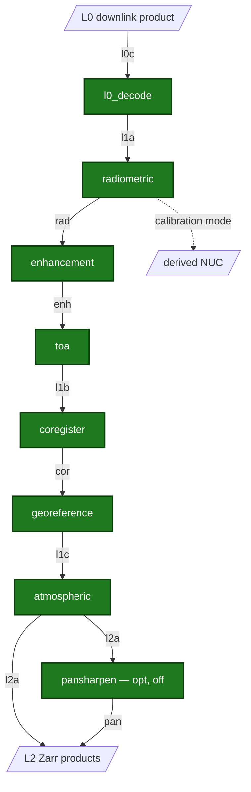

# Sentinel-2 MSI Payload Data Ground Segment Processor

  <strong>Status:</strong> Completed 
  <strong>Stack:</strong> Python · EOPF CPM 2.8.1 · Zarr · GDAL
  <strong>Lifecycle:</strong> ECSS-E-ST-40C Category C

## Overview

**msi-processor** is a generic high-resolution pushbroom multispectral imager (MSI) ground-segment data processor that process downlinked raw Level-0 instrument data into calibrated, geophysically usable products up to Level 2. It is built on the ESA EOPF Core Python Modules (`eopf == 2.8.1`, Zarr output) and developed under an ECSS-E-ST-40C Rev.1 documentation-first software lifecycle.

Each processing stage is an EOPF `EOProcessingUnit`: it consumes the previous unit's product under a named input key, takes Auxiliary Data Files (ADFs) as run inputs, and emits its product under a named output key.

## Architecture

**Implemented (CI-green):** foundation layer plus all eight processing units — `l0_decode`, `radiometric` (nominal and calibration modes), `enhancement` (MTF compensation + denoise), `toa`, `coregister`, `georeference`, `atmospheric`, and optional default-off `pansharpen`.

## Key technical work

- **L0 decode** — bit-exact ground decode of canonical compressed-ISP form; line-loss truncation; legality and QA seeding.
- **Radiometric** — NUC, dark correction, bad-pixel replacement, saturation handling; calibration mode derives NUC from dark + flatfield acquisitions.
- **Enhancement** — mandatory MTF compensation (PSF deconvolution) and configurable denoising.
- **TOA** — DN → radiance → reflectance with radiometric and spectral ADFs.
- **Coregister / georeference** — SIFT + homography band alignment; GCP refinement and cartographic-grid orthorectification.
- **Atmospheric** — 6S TOA → BOA inversion with spectral-threshold scene classification and cloud/shadow masks.
- Single pipeline driver (`scripts/run_pipeline.py`) with phase-structured, idempotent execution over a shared data-store.

## Results — Synthetic L0→L1B run

Output of a **L0→L1B** end-to-end run (`l0_decode → radiometric → enhancement → toa`, `nominal` mode): a persisted **L1B TOA-reflectance** EOPF product from the synthetic raw generator's open-container **Synthetic L0** + cal-DB ADFs.

| Band | mean (refl.) | std | SNR (dB) |
|------|-------------|-----|----------|
| B02 | 0.1753 | 0.0053 | 30.3 |
| B03 | 0.1888 | 0.0066 | 29.1 |
| B04 | 0.1911 | 0.0070 | 28.7 |
| B08 | 0.2648 | 0.0094 | 29.0 |
| B11 | 0.0434 | 0.0017 | 28.3 |
| B12 | 0.0535 | 0.0019 | 28.8 |

A second E2E result — **L1A bit-identity** through `l0_decode` (L1A′ ≡ L1A, 13/13 bands) — is documented in the generator's validation pages.

Reproduce: `python scripts/run_pipeline.py <store>` with phases `fetch-store → l0-decode → radiometric → enhancement → toa → stats → report`.

## Links

- [GitHub repository](https://github.com/AstroCan17/msi-processor)
- [Sentinel-2 MSI Synthetic Raw Data Generator validation](https://astrocan17.github.io/s2-msi-raw-generator/) (producer inputs)
- [IPF ecosystem case study]({{ site.baseurl }}/projects/ipf-ecosystem.html)

[← All projects]({{ site.baseurl }}/projects/)
