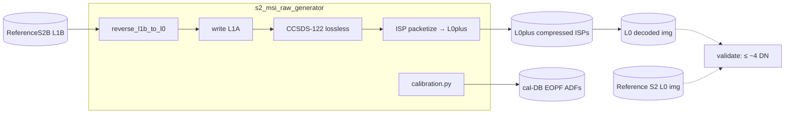

# Sentinel-2 MSI Synthetic Raw Data Generator

  <strong>Status:</strong> Deployed 
  <strong>Stack:</strong> Python 3.11 · NumPy · Zarr · CCSDS-122
  <strong>Reference:</strong> Sentinel-2 L1 ATBD (public)

## Overview

**s2-msi-raw-generator** runs a ReferenceSentinel-2B L1B backwards through the **exact inverse of the operational L0→L1B radiometric chain** to reconstruct the full EOPF product ladder — **L1A → L0plus (CCSDS-122 ISP) → L0** (focal-plane DN `img`, 12 detectors × 13 bands). The reconstructed L0 is validated directly against the **Reference S2 L0 `img`**, agreeing to **≤ ~4 DN on the ten 10 m + 20 m bands**.

The inversion undoes every ON forward step — radiometric offset, relative-response/PRNU, dark, un-bin, SWIR re-arrangement, defective pixels, crosstalk, on-board equalization. MTF-deconvolution is OFF in the operational chain, so PSF re-blur and noise are **not** re-applied. Built from the public L1 ATBD — no external processor.

## Architecture

## Key technical work

- **Reverse radiometric chain (S1–S15)** — inverts radiometric offset, binning, defective pixels, SWIR re-arrangement, relative response, crosstalk, dark, and on-board equalization per the operational ATBD.
- **CCSDS-122 codec** — lossless DWT 9/7-M + bit-plane coder; L0plus round-trip is **bit-exact** (`decode(L0plus) == L1A`), lossless ratio **3.66×**.
- **Calibration database derivation** — derives D, g, A coefficients from diffuser + dark acquisitions; non-tautological round-trip with the consumer processor.
- **Real-data validation** — 2024-04-08 S2B PPB L0/L1B pair, detector d05, framing-aligned to ADF_PRDLO co-registration crop.

## Results

**Synthetic L1A vs original ESA L0 `img` — detector d05:**

| band | B02 | B03 | B04 | B05 | B06 | B07 | B08 | B8A | B11 | B12 |
|------|-----|-----|-----|-----|-----|-----|-----|-----|-----|-----|
| RMSE (DN) | 0.8 | 1.5 | 1.8 | 1.1 | 1.0 | 0.9 | 0.8 | 1.1 | **4.2** | **3.9** |
| resolution | 10 m | 10 m | 10 m | 20 m | 20 m | 20 m | 10 m | 20 m | 20 m | 20 m |

All **ten 10 m + 20 m bands agree to ≤ ~4 DN**. Native-60 m bands (B01/B09/B10) have higher RMSE because reverse un-bin is ×3 line replication — sub-pixel detail averaged away by forward binning is irrecoverable.

| Forward step | Reverse op | ADF / GIPP |
|---|---|---|
| radiometric offset | `+ RADIO_ADD_OFFSET` (−100) | R2PARA |
| binning (60 m) | ×3 un-bin (replication) | — |
| defective pixels | re-stamp NoData | R2DEPI |
| SWIR re-arrangement | re-introduce staggered readout | RSWIR |
| relative response | impress G⁻¹ | R2EQOG |
| crosstalk | add back | RCRCO |
| dark | `+` L0-domain dark × DSNU shape | R2EQOG COEFF_D |
| on-board equalization | re-apply bilinear non-linearity | REOB2 |

## Links

- [GitHub repository](https://github.com/AstroCan17/s2-msi-raw-generator)
- [Documentation site](https://astrocan17.github.io/s2-msi-raw-generator/)
- [ReferenceE2E validation](https://astrocan17.github.io/s2-msi-raw-generator/vv/real_e2e.html)
- [msi-processor (consumer)]({{ site.baseurl }}/projects/msi-processor.html)

[← All projects]({{ site.baseurl }}/projects/)
