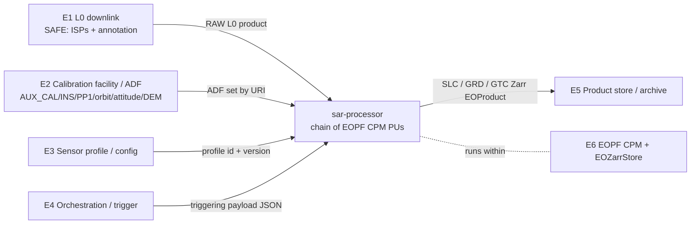

# sar-processor

  <strong>Status:</strong> SRR complete (pre-CDR)
  <strong>Stack:</strong> Python · EOPF CPM 2.8.1 · Zarr
  <strong>Reference profile:</strong> Sentinel-1 C-SAR

## Overview

**sar-processor** is a **generic spaceborne SAR ground-segment forward processor**: downlinked raw Level-0 SAR instrument source packets → focused **L1 SLC** → detected/projected **L1 GRD** (L2 ocean products TBC). The processing chain is sensor-agnostic and driven by a per-sensor profile; the first instantiated profile is a C-band SAR with **Sentinel-1 C-SAR** as the public reference dataset.

Built on the ESA **EOPF Core Python Modules** (`eopf == 2.8.1`): each processing stage is an `EOProcessingUnit`, products are EOPF `EOProduct` objects, outputs are cloud-native **Zarr**. Sibling project of [`msi-processor`](https://github.com/AstroCan17/msi-processor), reusing platform machinery (CI, documentation toolchain, package layout, single pipeline driver).

> **Status: SRR complete (pre-CDR).** The tailored ECSS document tree is in place. System and interface requirements are baselined at SRR (SSS, IRD, SDP, SPAP, SRevP, Risk Register, initial SRF). Software requirements, algorithms, and detailed design land at PDR/CDR; processing-stage implementation (WP-5) starts after CDR per the SDP.

## Documentation milestones

| Milestone | State | Key artefacts |
|-----------|-------|---------------|
| SRR | **Done** | SSS, IRD, SDP, SPAP, SRevP, Risk Register, SRF (initial) |
| PDR | Planned | SRS, ICD (prelim), DPM, ATBD, V&V Plan |
| CDR | Planned | SDD, SUITP, final ICD, traceability matrix |
| QR | Planned | SVR, SUITR, SRN, SUM |

## Architecture

### System context (IRD §4.1)

`sar-processor` is a batch component embedded in a larger EO ground segment. External interfaces:

| # | External system | Direction | Exchange |
|---|-----------------|-----------|----------|
| E1 | L0 ingestion / downlink chain | → in | RAW L0 SAR product (SAFE): ISPs + acquisition annotation |
| E2 | Calibration facility / ADF provider | → in | ADF set (AUX_CAL, AUX_INS, orbit, attitude, DEM) |
| E3 | Sensor profile / configuration | → in | Per-sensor profile + run configuration |
| E4 | Processing orchestration / trigger | → in | Job order (triggering payload) |
| E5 | Product store / archive | ← out | L1 SLC / L1 GRD / GTC as Zarr `EOProduct` |
| E6 | EOPF CPM framework + storage | host | Runtime: `EOProcessingUnit` / `EOZarrStore` API |

### Software layers (SDD §4.1)

Three layers mirror the `msi-processor` precedent and the `sar_processor/` package skeleton:

- **C-COMMON** (`sar_processor/common/`) — platform layer: CPM-free shared types and QA metrics.
- **C-PU-\*** (`sar_processor/computing/<stage>/`) — one component per processing stage; each stage = `core.py` (pure numpy algorithm) + `unit.py` (EOPF `EOProcessingUnit` wrapper).
- **C-SENSORS** (`sar_processor/sensors/`) — sensor adaptation: per-sensor profile loading; no instrument constants hardcoded in code.

Current code under these paths is **scaffold placeholders** until WP-5 (post-CDR).

## Key technical work

- **SRR-baselined ECSS documents** — SSS, IRD, SDP, SPAP, SRevP, Risk Register, initial SRF in `compliance/drd/`.
- **Package layout** — `sar_processor/common/`, `computing/`, `sensors/`, `exceptions/` (target layout; scaffold until CDR).
- **Pipeline driver** — `scripts/run_pipeline.py` with mode-only CLI: `nominal` | `calibration`.
- **CI & docs** — GitHub Actions on push/PR; GitHub Pages docs at [astrocan17.github.io/sar-processor](https://astrocan17.github.io/sar-processor/).
- **Codespaces** — public code + private `ipf-data` dataset (`datasets-sar-v1`); `make data-sync` for local refresh.

## Planned processing chain

| Stage | Output | Notes |
|-------|--------|-------|
| L0 decode | Parsed SAR packets | Sensor-profile dependent |
| Range processing | Range-compressed data | Reference: Sentinel-1 IW/EW |
| Azimuth focusing | L1 SLC | TOPSAR / ScanSAR modes TBC |
| GRD generation | L1 GRD | Multilook + ground projection |
| L2 ocean | TBC | Wind / wave products at PDR |

## Links

- [GitHub repository](https://github.com/AstroCan17/sar-processor)
- [Documentation site](https://astrocan17.github.io/sar-processor/)
- [msi-processor (sibling)]({{ site.baseurl }}/projects/msi-processor.html)

### Documentation (GitHub Pages)



[← All projects]({{ site.baseurl }}/projects/)
